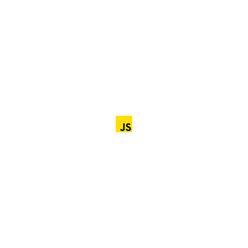

<h2>Histoire</h2>

<h2>Contexte</h2>

<h2>Contraintes imposées</h2>

<h2>Fonctionnnalités supplémentaire</h2>

<h1>Technologies utilisées</h1>

<h2>Front-end</h2>

<h2>Outils</h2>

<h2>Capture d'écran</h2>

<h2>Membres de l'équipe</h2>

